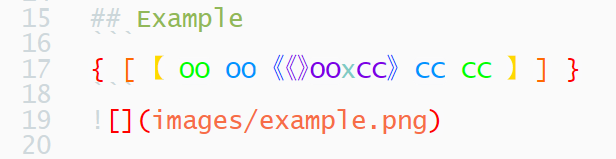
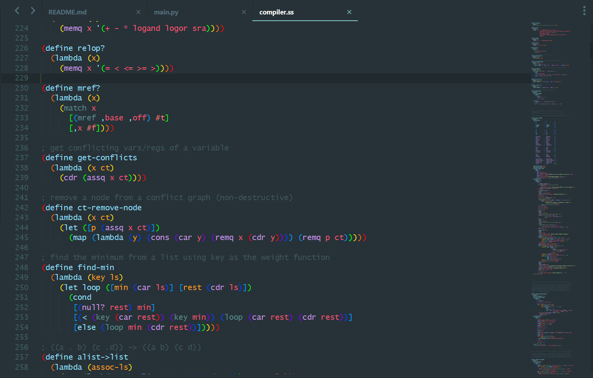

# RainbowBrackets

[![License][license-image]](/LICENSE)
[![Downloads][packagecontrol-image]][packagecontrol-link]


## Introduction

RainbowBrackets uses the brackets and colors that you give in the settings file, searches and highlights brackets in file views. Brackets at different levels will be dyed with different colors according to the settings. Colors are gave in a list, and will be used repeatedly.

parentheses, braces, brackets are treated as brackets. brackets are configured in setting file, it means you can use `OO` as a opening bracket and `CC` as a close bracket. some characters will cause many match error, can't serve as brackets, such as `<>`.


## Example
```
{ [ 【 OO OO 《《》OOxCC》 CC CC 】 ] }
```



## Installation

Clone or download this repository to your **Packages directory** of Sublime Text. Note that the directory name should be the name of this repository.

If you have installed Package Control, press down <kbd>ctrl+shift+p</kbd> to get into the command palette, then, input the command `pcip (Package Control: Install Package)` and <kbd>Enter</kbd> to run it. Wait some time… After package infomations have been loaded remotely, input the name of this plugin `RainbowBrackets`, and press down <kbd>Enter</kbd> to install it.


## Usage

### Settings

Settings template

```json
{
    "debug": false,

    "brackets": {
        // opening must in pairs
        "pairs": {
            "(": ")",
            "[": "]",
            "{": "}"
        },

        "filetypes": {
            "default": {
                "opening": ["(", "[", "{"],
                "ignored_scopes": [
                    "comment", "string"
                ]
            },

            "scheme": {
                "opening": ["(", "[", "{"],
                "ignored_scopes": [
                    "comment", "string", "constant.character", "symbol"
                ],
                "extensions": [
                    "scm",
                    "ss"
                ]
            },

            "json": {
                "opening": ["[", "{"],
                "ignored_scopes": [
                    "comment", "string"
                ],
                "extensions": [
                    "json",
                    "sublime-settings",
                    "sublime-menu",
                    "sublime-build",
                    "sublime-keymap",
                    "sublime-commands",
                    "sublime-theme",
                    "sublime-color-scheme"
                ]
            },
            // Add custom file types here.
        }
    },

    "rainbow_colors": {
        "matched": [
            "#FF0000",   /* level1  */
            "#FF6A00",   /* level2  */
            "#FFD800",   /* level3  */
            "#00FF00",   /* level4  */
            "#0094FF",   /* level5  */
            "#0041FF",   /* level6  */
            "#7D00E5"    /* level7  */
        ],
        "mismatched": "#FF0000"
    }
}
```

- `ignored_scopes`: to ignore brackets in some scopes(such as comment, string).
- `pairs`: global brackets pairs dict, opening brackets(left brackets) as keys and closing brackets(right brackets) as values.
- `opening`: left parts of brackets pairs to be searched.

### Commands
- Preferences: RainbowBrackets Settings
- RainbowBrackets: toggle debug
- RainbowBrackets: make rainbow
- RainbowBrackets: clear rainbow
- RainbowBrackets: clear color schemes

### Key bindings
RainbowBrackets support fast opreating brackets, including `select`, `remove` and `transform`.

| Keys                        | Description                                                  |
| :-------------------------- | :----------------------------------------------------------- |
| <kbd>ctrl+alt+9</kbd>       | Replace the brackets around the cursors with `()`            |
| <kbd>ctrl+alt+0</kbd>       | Replace the brackets around the cursors with `()`            |
| <kbd>ctrl+alt+[</kbd>       | Replace the brackets around the cursors with `[]`            |
| <kbd>ctrl+alt+]</kbd>       | Replace the brackets around the cursors with `[]`            |
| <kbd>ctrl+alt+shift+[</kbd> | Replace the brackets around the cursors with `{}`            |
| <kbd>ctrl+alt+shift+]</kbd> | Replace the brackets around the cursors with `{}`            |
| <kbd>ctrl+alt+r</kbd>       | Remove the brackets around the cursors                       |
| <kbd>ctrl+alt+.</kbd>       | Remove the brackets around the cursors and select the text within the brackets |
| <kbd>ctrl+alt+,</kbd>       | Select the brackets around the cursors and the text within the brackets |


## Screenshots

- Material color scheme, JSON file.
  
- Material color scheme, Scheme language
  
- Material lighter color scheme, Scheme language
  


[license-image]: https://img.shields.io/badge/license-MIT-blue.svg
[packagecontrol-image]: https://img.shields.io/packagecontrol/dt/RainbowBrackets.svg
[packagecontrol-link]: https://packagecontrol.io/packages/RainbowBrackets
