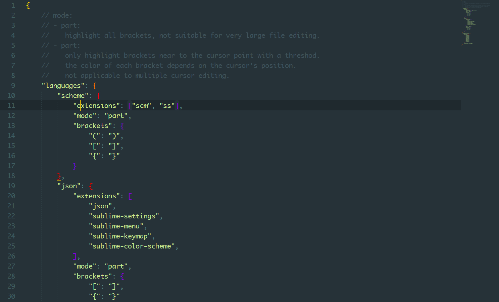
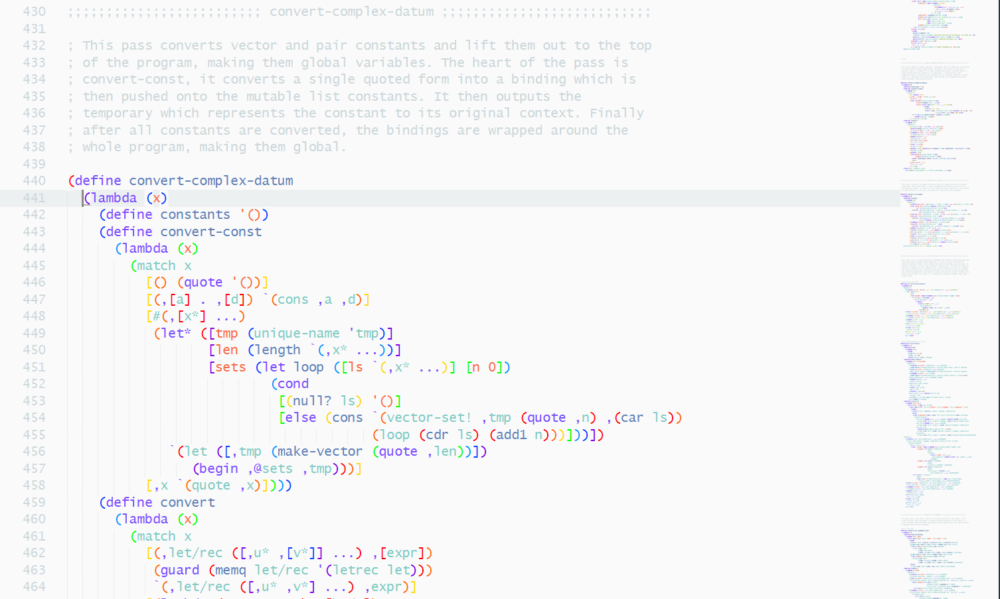

# RainbowBrackets

[![License][license-image]](/LICENSE)
[![Downloads][packagecontrol-image]][packagecontrol-link]


## Introduction

Hi, welcome to use my plugins!

This plugin I wrote for **SublimeText** is to highlight brackets. It matches brackets you have added for the file type, then gives brackets at different levels different colors, in the cycle of the number of colors. colors are gave in the settings file, by default, there are 7 type of colors.

parentheses, braces, brackets are treated as brackets. brackets are configured in setting file, it means you can use R as a opening bracket and L as a close bracket. But, not all strings can be used as brackets, it depends on the token rules which sublime_text has used in the file. The main reason for this is to ignore comments and strings.

Some plugins such as **Color Highlighter** only works in `.tmTheme` formated color scheme, but you needn't worry about that when using this plugin, this plugin works well both in `.sublime-color-scheme` and `tmTheme` formated color scheme. Not only that，whenever you change you color scheme setting, it will readapt the new color scheme's background, without restarting sublime_text.

Please don't mind my poor English. I'm trying to learn it.:-)


## Installation

Clone or download this repository to your SublimeText's **Packages** directory.
Note that the directory name should be the name of this repository.
Also, if you have installed Package Control, just use it, they have accepted my plugin.


## Usage

The mode `"part"` will only highlight brackets around the cursor, with a threshold for the number of characters to be searched. For the reason of speed, you can use this mode, but I do not recommend it, you will know.

Settings are easy to understand, if you have patience, try to change them and notice changes of views.

## Add your language

Adding setting
```json
"json": {}
```
to `"languages"` will make JSON file be supported. If you care about more, the following settings means, at a JSON file, "(" and ")" will be remove from global `"brackets"` setting, so it will get a better speed and sometimes is more advisable.
files with extensions listed in `"extensions"` will be treated as JSON files.

mode `"all"` indicated that when you open files treated as JSON files, the plugin will search full text to highlight brackets added in global `"brackets"` setting, except bracket-pairs whose left-part are listed in `"!brackets"`.

```json
"json": {
    "extensions": [
        "json",
        "sublime-settings",
        "sublime-menu",
        "sublime-build",
        "sublime-keymap",
        "sublime-color-scheme"
    ],
    "mode": "all",
    "!brackets": ["("],
}
```


## Screenshots

- Material color scheme, JSON file.
  
- Material color scheme, Scheme language
  
- Material lighter color scheme, Scheme language
  


[license-image]: https://img.shields.io/badge/license-MIT-blue.svg
[packagecontrol-image]: https://img.shields.io/packagecontrol/dt/RainbowBrackets.svg
[packagecontrol-link]: https://packagecontrol.io/packages/RainbowBrackets
